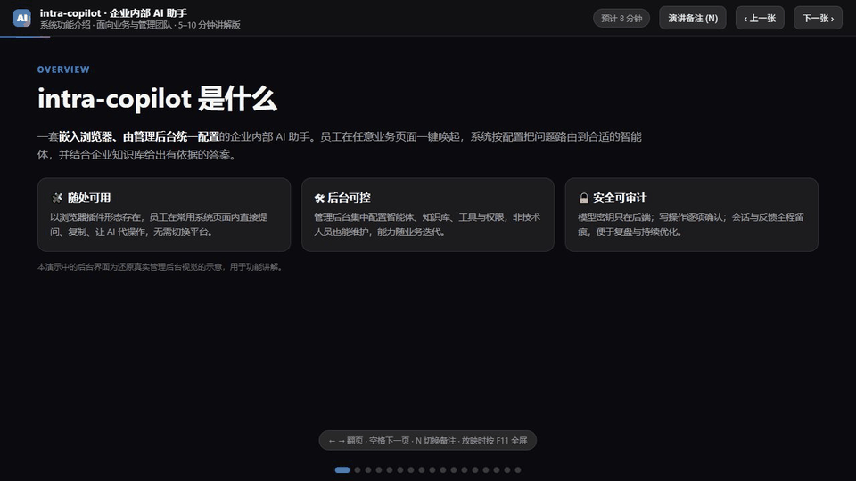
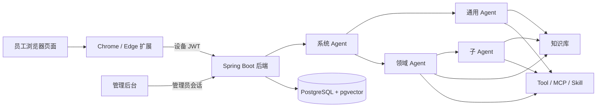
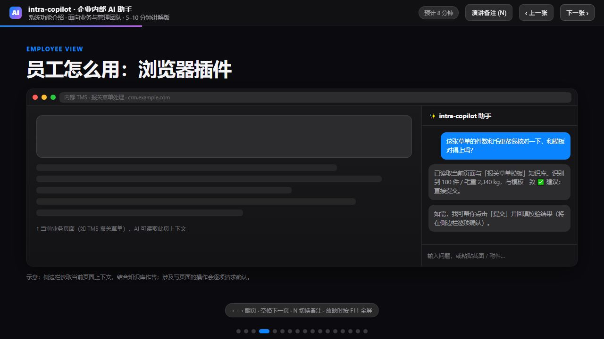
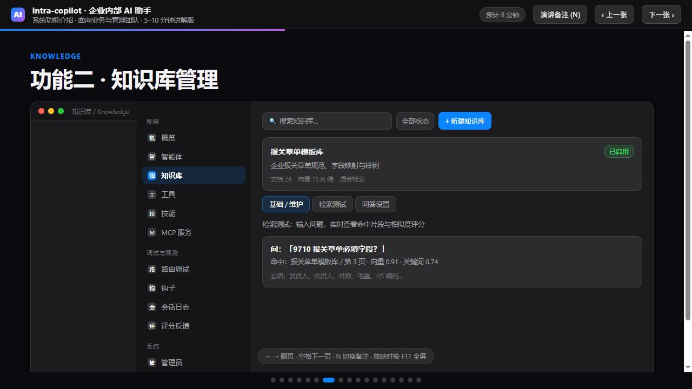
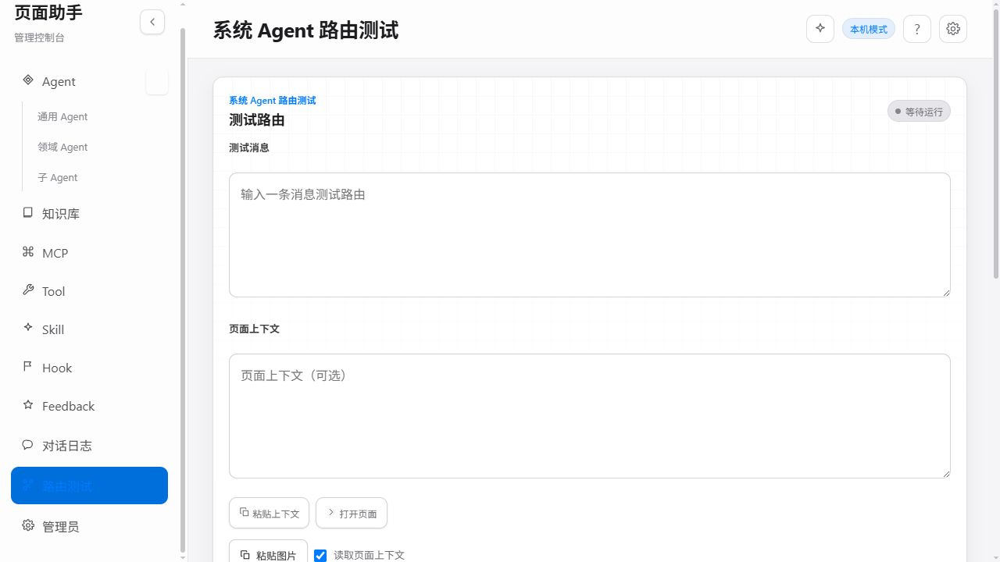
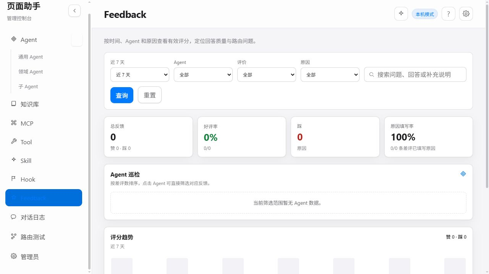

# intra-copilot 功能与使用指南

intra-copilot 是一套面向企业内部场景的浏览器 AI 助手。它以 Chrome / Edge 扩展作为员工入口，以 Spring Boot 服务作为模型、知识库、工具和 Agent 编排引擎，并提供独立管理后台统一维护配置、查看执行轨迹和收集反馈。



> 上图用于快速说明核心交互路径，界面数据已做通用化处理；实际页面文案和可用能力以当前部署版本为准。

## 目录

- [1. 项目定位](#1-项目定位)
- [2. 功能总览](#2-功能总览)
- [3. 部署与接入](#3-部署与接入)
- [4. 员工使用](#4-员工使用)
- [5. 管理端使用](#5-管理端使用)
- [6. 安全、隔离与审计](#6-安全隔离与审计)
- [7. 常见排查](#7-常见排查)
- [8. 最短接入路径](#8-最短接入路径)

## 1. 项目定位

intra-copilot 解决的不是“多一个聊天窗口”，而是把企业已有的页面上下文、业务知识、系统接口和 AI 能力放到员工正在工作的页面里。

典型使用流程：

1. 员工在当前业务页面唤起侧边栏或悬浮球。
2. 插件按用户选择采集页面标题、网址、选中文本、可见文本和页面结构摘要。
3. 后端系统 Agent 识别意图，并路由到通用 Agent、领域 Agent 或继续委派子 Agent。
4. 执行 Agent 按配置检索知识库、调用 Tool / MCP 服务、应用 Skill 提示词。
5. 答案返回侧边栏；涉及点击、填写、跳转等页面写入操作时，由员工逐项确认后执行。
6. 会话、路由、工具调用和反馈进入管理端，供排查与持续优化。



### 主要技术组成

| 组成 | 技术栈 | 作用 |
| --- | --- | --- |
| 浏览器扩展 | Chrome / Edge MV3、React、TypeScript、Vite | 页面助手、悬浮球、侧边栏、附件、页面动作确认 |
| 后端服务 | Java 17、Spring Boot 3.4、Spring AI 1.0、MyBatis-Plus | 模型调用、Agent 编排、鉴权、知识检索、Tool / MCP 执行 |
| 管理后台 | React、TypeScript、Vite | Agent、知识库、Tool、Skill、MCP、Hook、日志、反馈和用户管理 |
| 数据库 | PostgreSQL 16、pgvector | 会话、配置、审计记录和向量数据 |
| 文档存储 | 本地磁盘或 MinIO | 知识文档与聊天附件 |

## 2. 功能总览

### 2.1 员工侧

| 功能 | 说明 |
| --- | --- |
| 页面内助手 | 通过扩展侧边栏或悬浮球在业务页面直接提问，不中断当前工作流 |
| 页面上下文 | 可按需携带当前网址、页面标题、选中文本、可见文本和 DOM 摘要 |
| 多标签页上下文 | 可选择其他已打开标签页加入当前问题 |
| 图片与文件 | 支持上传图片、普通附件，或在页面上框选截图后提问 |
| Agent 选择 | 支持“自动”路由，也可手动选择已启用的通用 Agent 或领域 Agent |
| 知识检索与工具调用 | 执行 Agent 可组合知识库、Tool、MCP 和 Skill 完成回答或操作 |
| 页面动作确认 | 点击、填写、跳转等写操作以提案方式展示，执行前逐项确认 |
| 会话历史 | 支持新建、搜索、重命名、排序、批量删除和会话切换 |
| 反馈 | 对回答点赞或点踩，点踩可补充“不准确、答非所问、太长、格式/UI、其他”等原因 |
| 个人设置 | 支持主题、语言、侧边栏启用范围、悬浮球显示范围和页面读取权限 |

### 2.2 管理端

| 模块 | 主要能力 |
| --- | --- |
| 系统 Agent | 查看入口状态、活跃节点、路由覆盖、委派链路和配置风险 |
| AI 工作台 | 以“助手 / 生成 Agent / 验证 Agent”三种模式辅助配置、生成草案和验证效果 |
| Agent | 管理通用、领域、子 Agent，配置提示词、路由规则、模型、资源绑定和发布版本 |
| 知识库 | 上传 Markdown / TXT / PDF，重建索引，配置检索策略、问答提示词和向量模型 |
| Tool | 注册 HTTP API Tool 或浏览器动作 Tool，测试参数并启用给 Agent |
| Skill | 管理可复用提示词技能、激活方式、版本、发布、回滚和试跑 |
| MCP 服务 | 注册 SSE / Streamable HTTP MCP Server，执行健康检查并查看接口能力 |
| Hook | 在路由前或 Agent 执行前执行权限、页面上下文、长度和关键词校验 |
| 路由测试 | 输入消息、页面上下文或图片，预检完整路由链路、资源装配和置信度 |
| 对话日志 | 按会话查看消息、Agent 调用链、事件、执行计划、Token 和异常 |
| Feedback | 汇总好评率、差评原因、趋势和 Agent 巡检建议 |
| 管理员 | 新建、停用、重置密码；账号用于登录和操作归属，业务资源由管理员共享 |

## 3. 部署与接入

### 3.1 环境要求

| 依赖 | 用途 |
| --- | --- |
| Java 17 | 运行后端 |
| Maven | 构建和启动 Spring Boot |
| Node.js / npm | 构建管理后台和浏览器扩展 |
| PostgreSQL 16 + pgvector | 业务数据和向量检索 |
| OpenAI 兼容模型服务 | Chat Completion 与 Embedding |
| Chrome / Edge Chromium 浏览器 | 加载 MV3 扩展 |

### 3.2 启动 PostgreSQL 和后端

仓库提供了 PostgreSQL + pgvector 的 Docker Compose 配置：

```powershell
docker compose up -d postgres
```

配置模型、数据库和管理员账号。以下示例使用 OpenAI 兼容地址；`LLM_BASE_URL` 和 `EMBEDDING_BASE_URL` 通常应包含 `/v1`：

```powershell
$env:LLM_BASE_URL="https://your-llm.example.com/v1"
$env:LLM_API_KEY="your-llm-key"
$env:LLM_MODEL="your-chat-model"
$env:LLM_COMPLETIONS_PATH="/chat/completions"

$env:EMBEDDING_BASE_URL="https://your-embedding.example.com/v1"
$env:EMBEDDING_API_KEY="your-embedding-key"
$env:EMBEDDING_MODEL="your-embedding-model"
$env:EMBEDDING_PATH="/embeddings"
$env:EMBEDDING_DIMENSION="1536"

$env:DATABASE_URL="jdbc:postgresql://127.0.0.1:5432/intra_copilot"
$env:DATABASE_USERNAME="intra"
$env:DATABASE_PASSWORD="intra"

$env:ADMIN_USERNAME="admin"
$env:ADMIN_PASSWORD="replace-with-a-strong-password"
$env:ADMIN_SESSION_SECRET="replace-with-a-long-random-value"
```

启动后端：

```powershell
cd backend
mvn spring-boot:run
```

默认地址为 `http://127.0.0.1:8080`，健康检查：

```powershell
Invoke-RestMethod http://127.0.0.1:8080/actuator/health
```

关键环境变量：

| 变量 | 默认值 | 说明 |
| --- | --- | --- |
| `LLM_BASE_URL` | `https://api.openai.com/v1` | Chat 模型 OpenAI 兼容地址 |
| `LLM_API_KEY` | 空 | Chat 模型密钥，只保存在后端 |
| `LLM_MODEL` | `gpt-4o-mini` | Chat 模型名 |
| `LLM_COMPLETIONS_PATH` | `/chat/completions` | 相对 `LLM_BASE_URL` 的补全路径 |
| `EMBEDDING_BASE_URL` | 继承 `LLM_BASE_URL` | Embedding 服务地址 |
| `EMBEDDING_API_KEY` | 继承 `LLM_API_KEY` | Embedding 密钥 |
| `EMBEDDING_MODEL` | `text-embedding-3-small` | Embedding 模型名 |
| `EMBEDDING_DIMENSION` | `1024` | 服务默认向量维度；必须与模型和数据库向量列一致，常见 OpenAI 模型可能需要设为 1536 |
| `EMBEDDING_PATH` | `/embeddings` | 不要重复填写 `/v1` |
| `RAG_TOP_K` | `5` | 默认召回数量 |
| `RAG_SIMILARITY_THRESHOLD` | `0.50` | 默认最低相关度 |
| `AGENT_LLM_TIMEOUT_SECONDS` | `180` | 单次模型调用超时 |
| `AGENT_SSE_TIMEOUT_SECONDS` | `600` | SSE 流式连接超时 |
| `ADMIN_PASSWORD` | `admin` | 管理员密码，生产环境必须修改 |
| `ADMIN_SESSION_SECRET` | 空 | 不配置时重启会使已有管理员登录失效 |
| `CORS_ALLOWED_ORIGINS` | 本地开发地址与扩展来源 | 部署后填写管理端和扩展允许来源 |
| `MINIO_ENABLED` | `false` | `false` 使用本地磁盘，`true` 使用 MinIO |

> Embedding 维度变更会影响已有向量。切换模型或维度后，需要在知识库中重新构建索引并验证检索结果。

### 3.3 启动管理后台

开发模式：

```powershell
cd admin
npm install
$env:VITE_API_BASE="http://127.0.0.1:8080/api/v1"
npm run dev
```

默认开发地址为 `http://127.0.0.1:4174`。

生产构建：

```powershell
cd admin
$env:VITE_API_BASE="https://copilot.example.com/api/v1"
npm run build
```

构建产物位于 `admin/dist/`，可部署到任意静态 Web 服务器。管理端通过登录接口获取 Bearer Token；除登录接口外，`/api/v1/admin/**` 接口都需要管理员会话。

### 3.4 构建并加载浏览器扩展

```powershell
cd extension
npm install
$env:VITE_API_BASE="https://copilot.example.com/api/v1"
npm run build
```

在 Chrome / Edge 中：

1. 打开扩展管理页。
2. 开启“开发者模式”。
3. 选择“加载已解压的扩展”。
4. 选择 `extension/dist/`。
5. 点击浏览器工具栏中的扩展图标，或使用页面悬浮球打开侧边栏。

扩展首次启动时会生成设备 RSA 密钥对，并自动向 `/api/v1/auth/devices/register` 注册设备公钥。后续请求由扩展使用设备私钥签发短期 RS256 JWT；私钥仅保存在 `chrome.storage.local` 中，模型密钥不会进入扩展。

### 3.5 接入内部业务页面

当前版本通过浏览器扩展适配业务页面，通常不需要修改业务系统：

1. 确认扩展具有目标页面的访问权限。
2. 在“设置 → 悬浮球显示范围”中选择“所有页面开启”或“仅在手动开启的页面使用”。
3. 如页面需要由 Agent 操作，创建 `BROWSER_PROPOSAL` Tool 并绑定到对应 Agent。
4. 在“设置 → 权限”中允许读取当前页面上下文。
5. 使用“路由测试”验证页面上下文、领域 Agent、知识库和 Tool 是否命中。

浏览器内置页、扩展管理页、部分受保护页面不允许注入或截图，这是浏览器安全限制。若业务系统有独立域名，建议将后端域名、扩展分发页和管理端一起纳入企业统一部署。

### 3.6 当前接入边界

- 仓库内已实现浏览器扩展接入和设备 JWT 鉴权。
- 后端接口采用 OpenAI 兼容协议接入模型与 Embedding 服务。
- Tool 可接入任意允许访问的 HTTP / HTTPS 接口；默认允许 HTTP，但默认拒绝内网与本机地址，需要显式设置 `TOOLS_ALLOW_PRIVATE_NETWORK=true`。
- MCP 支持 SSE 和 Streamable HTTP；默认不启用 stdio。
- 当前版本没有独立的 Web / 桌面嵌入 SDK。外部系统接入应复用设备注册与 JWT 请求协议，或在后续 SDK 中封装相同流程。

## 4. 员工使用



### 4.1 打开与显示范围

打开方式：

- 点击浏览器工具栏中的 intra-copilot 图标。
- 在已启用页面点击悬浮球。

侧边栏显示范围：

- 默认只在打开侧边栏的标签页显示。
- 在“设置 → 侧边栏”中开启“在所有标签页启用”后，当前浏览器窗口内的所有标签页都可以持续显示。

悬浮球显示范围：

- “所有页面开启”：所有允许注入的普通网页显示悬浮球。
- “仅在手动开启的页面使用”：只对当前手动启用的页面显示。

### 4.2 提问与选择 Agent

在输入框中描述问题，`Enter` 发送，`Shift + Enter` 换行。

Agent 选择方式：

| 选项 | 使用场景 |
| --- | --- |
| 自动 | 推荐默认方式，由系统 Agent 识别意图并路由 |
| 通用 Agent | 通用问答或不属于特定领域的问题 |
| 领域 Agent | 已知问题属于某个业务领域时手动指定 |

子 Agent 不直接出现在员工可选列表中，它由父级领域 Agent 按绑定关系和路由规则继续委派。

### 4.3 添加页面上下文

在输入框下方打开“页面信息”，按需选择：

| 信息 | 内容 |
| --- | --- |
| 当前网址 | 当前标签页 URL |
| 页面标题 | 浏览器标题 |
| 选中文本 | 当前选中的文本，最多约 4000 字符 |
| 可见文本 | 页面可见正文，最多约 12000 字符 |
| 页面结构摘要 | 页面中的输入框、按钮、下拉框、文本域和链接摘要 |

另外可以：

- 选择其他已打开标签页加入上下文。
- 上传图片或普通附件。
- 使用“从屏幕上选择”框选页面区域并作为图片发送。
- 在“权限”中选择是否允许读取当前页面上下文。

读取页面并不等于允许写入页面。即使已经授权读取，点击、填写、跳转等操作仍会单独请求确认。

### 4.4 理解回答与执行过程

回答消息可能包含：

- 实际处理的 Agent 名称。
- 当前生成阶段，例如分析问题、查询知识库、生成回答。
- 可展开的“执行过程”，显示 Tool 名称、参数、返回值和成功/失败状态。
- 复制回答、复制代码、重试、重新编辑并发送等操作。
- 生成过程中的停止按钮。

如果页面操作需要用户确认，侧边栏会显示操作类型、原因和风险。只有确认后才会执行。

### 4.5 会话历史

侧边栏支持：

- 新建会话。
- 打开历史会话并切换。
- 搜索会话。
- 修改会话名称。
- 删除单个或批量删除会话。
- 调整会话排序。

会话数据按设备身份隔离。设备身份默认对应后端生成的 `anon-{deviceId}`，不同设备或浏览器配置之间不会共享历史会话。

### 4.6 评分反馈

每条回答都可以点赞或点踩。点踩时可选择原因并补充说明：

- 不准确
- 答非所问
- 太长
- 格式 / UI
- 其他

再次点击可以撤销投票。反馈会进入管理端“Feedback”页面，用于定位 Agent、知识库和提示词问题。

### 4.7 个人设置

| 设置项 | 可选值 |
| --- | --- |
| 外观 | 跟随系统、浅色、深色 |
| 语言 | 中文、English |
| 侧边栏范围 | 当前标签页 / 所有标签页 |
| 悬浮球范围 | 所有页面 / 手动开启页面 |
| 页面权限 | 允许 / 禁止读取当前页面上下文 |

## 5. 管理端使用

### 5.1 登录与系统运行看板

管理员使用后端环境变量中配置的 `ADMIN_USERNAME` 和 `ADMIN_PASSWORD` 登录。

登录后首先看到系统 Agent 页面。系统 Agent 是全局请求入口：

- 已启用时，接收员工请求并识别意图。
- 负责分发到通用 Agent 或领域 Agent。
- 无法匹配业务领域时，将请求交给已启用的通用 Agent 兜底。
- 系统 Agent 本身不作为业务答案节点。

系统运行看板展示：

- 入口是否在线。
- 已启用执行 Agent / 全部执行 Agent。
- 是否存在可用兜底能力。
- 已绑定父 Agent 的子 Agent 数量。
- 通用、领域、子 Agent 的启用覆盖率。
- 路由拓扑和链路检查。

常见风险提示：

- 系统入口被停用。
- 没有启用的通用 Agent，未匹配请求没有兜底。
- 没有启用领域 Agent，业务请求无法按领域分发。
- 子 Agent 缺少有效父节点，无法被自动委派。

### 5.2 AI 工作台

右上角“AI 工作台”提供三种工作模式：

| 模式 | 作用 |
| --- | --- |
| 助手 | 基于当前 Agent 配置回答问题，并生成可审核的表单修改建议 |
| 生成 Agent | 通过需求访谈生成资源与 Agent 草案 |
| 验证 Agent | 静态检查、生成验证场景、逐项执行行为验证并给出修订建议 |

安全约束：

- 助手建议必须先应用到表单并检查，再保存。
- 新建资源或 Agent 必须确认提案后才会创建。
- 新生成的 Agent 以停用、未发布草案保存，不会直接上线。
- 验证历史只用于追溯；需要修改时重新运行验证。

### 5.3 Agent 管理

#### Agent 角色

| 角色 | 说明 | 是否可直接选择 |
| --- | --- | --- |
| 系统 Agent | 全局请求入口，负责意图识别和路由 | 系统内置 |
| 通用 Agent | 通用问答或未匹配领域的兜底节点 | 是 |
| 领域 Agent | 承接某一业务领域，可自行处理或继续委派 | 是 |
| 子 Agent | 由父级 Agent 按规则委派执行 | 否 |

#### Agent 配置项

每个 Agent 可按标签页配置：

- 基础：名称、ID、描述、系统提示词、启用状态、模型、温度。
- 路由：路由规则、优先级、角色、父 Agent、分发模式。
- 策略：直接处理 / 委派 / 自动、子 Agent 返回方式、规划模式和最大规划步骤。
- 子 Agent：绑定子 Agent，并为每个子 Agent 配置路由规则。
- 知识库：绑定可检索的知识库。
- Tool：绑定可调用的后端 API 或浏览器动作。
- Skill：绑定可复用的提示词技能。
- Hook：查看或关联执行前校验规则。
- 版本：保存草稿、发布、查看发布历史和回滚。

推荐配置顺序：

1. 填写清晰的职责描述和系统提示词。
2. 设置领域边界和路由规则。
3. 绑定知识库、Tool、Skill。
4. 如有复杂任务，再配置子 Agent 和规划策略。
5. 执行“测试 Agent”或进入“路由测试”。
6. 保存草稿后发布。

运行时会使用已发布版本。草稿保存后如果没有发布，不会影响线上 Agent。

### 5.4 知识库管理



#### 创建和维护

1. 点击“新建知识库”，填写名称和描述。
2. 进入“知识维护”，上传 `.md`、`.markdown`、`.txt` 或 `.pdf`。
3. 等待文档状态从待处理 / 索引中变为已解析；失败时查看错误并重新解析。
4. 打开文档详情查看切片内容，确认 PDF 页号和文本解析结果。

支持批量上传。删除知识库前需要先停用；文档可以单独查看、重新索引或删除。

#### Embedding 配置

知识库默认继承系统 Embedding 配置，也可以单独配置：

- Provider
- Base URL
- 模型
- API Key
- 向量维度

保存前建议点击“检测配置”验证服务可达性和实际维度，并可运行诊断检查文档、Embedding 表和错误文档。

不匹配的 Embedding 模型或维度会导致检索效果变差，甚至无法使用。切换配置后应重建索引并运行检索测试。

#### 检索策略

| 配置 | 说明 |
| --- | --- |
| Top K | 每次最多返回多少个切片，范围 1–20 |
| 最低相关度 | 低于阈值的结果默认不返回 |
| 检索模式 | `DENSE` 仅向量检索；`HYBRID` 融合向量相似度和关键词匹配 |
| 关键词权重 | 仅在混合检索中生效，`0` 表示完全依赖向量 |
| 无结果时兜底 | 没有结果达到阈值时仍返回最接近的一项，便于核对 |

#### 问答场景设置

可为知识库配置问答提示词和 Top K，约束回答风格、引用方式以及检索范围。

#### 检索测试

输入一条真实业务问题，查看：

- 命中的文件名和页码。
- 最终得分、向量得分和关键词得分。
- 实际召回文本。
- 是否低于阈值。
- 使用的检索模式和排名。

当回答缺少依据时，先使用检索测试确认问题出在文档解析、切片、Embedding、阈值还是 Agent 提示词。

### 5.5 Tool 管理

Tool 表示 Agent 可以调用的外部能力，支持两种类型：

| 类型 | 用途 |
| --- | --- |
| `HTTP` | 调用后端 HTTP / HTTPS API |
| `BROWSER_PROPOSAL` | 生成点击、填写、设置编辑器或跳转等浏览器动作提案 |

HTTP Tool 主要字段：

- 名称和描述。
- `GET`、`POST`、`PUT`、`PATCH` 或 `DELETE`。
- Endpoint；路径参数可使用 `{name}`。
- JSON Schema 参数定义。
- 超时时间，范围 500–60000 毫秒。
- 认证 Header 名称和对应环境变量名。

认证值只从服务端环境变量读取，不应写在 Tool 配置或管理端页面中。

测试 Tool 时填写 JSON 参数并执行。删除 Tool 前必须先停用，并解除所有 Agent 和 Skill 引用。

网络限制：

- `TOOLS_ALLOW_HTTP=true` 时允许 HTTP；建议生产环境使用 HTTPS。
- `TOOLS_ALLOW_PRIVATE_NETWORK=false` 时拒绝内网、本机和链路本地地址。
- 工具请求不跟随重定向。
- 云实例元数据地址始终拒绝访问。

### 5.6 Skill 管理

Skill 是可复用、可版本化的提示词能力。

主要配置：

- 名称、描述和提示词。
- 激活方式：`ALWAYS` 始终应用，或 `KEYWORD` 根据关键词触发。
- 优先级。
- 最大提示词长度和 Token 预算。
- 关联 Tool。
- 草稿和已发布版本。

建议流程：

1. 新建或编辑 Skill 草稿。
2. 使用“试跑”组装最终系统提示词，检查是否被触发和是否超出预算。
3. 将 Skill 绑定到 Agent。
4. 发布草稿生成不可变版本。
5. 需要回退时选择历史版本回滚；回滚会生成新版本，不修改旧版本记录。

草稿不会影响线上；运行时使用已发布版本。

### 5.7 MCP 服务

MCP 用于接入标准 MCP Server。

支持的传输类型：

- `SSE`
- `STREAMABLE_HTTP`

配置项包括名称、描述、服务地址、传输类型、认证环境变量和启用状态。

“检查健康”会执行 MCP `initialize` 和 `tools/list`，并缓存：

- 健康状态。
- 接口数量。
- 服务能力。
- 接口详情。
- 最近检查时间、延迟和错误。

运行时，启用的 MCP 接口会作为 Agent 可用 Tool 暴露；停用服务后，其接口不再进入后续调用。

默认限制：

- `MCP_ALLOW_PRIVATE_NETWORK=true`，适合内网服务。
- `MCP_ALLOW_STDIO=false`，默认禁止本地进程型 MCP。
- 健康检查超时由 `MCP_TIMEOUT_MS` 控制。

### 5.8 Hook 管理

Hook 用于在 Agent 执行前执行权限、上下文和内容规则。

执行阶段：

| 阶段 | 说明 |
| --- | --- |
| 路由前 | 在系统 Agent 路由前检查 |
| Agent 执行前 | 在实际 Agent 处理前检查 |

规则类型：

| 规则 | 用途 |
| --- | --- |
| 需要页面读取授权 | 要求用户允许读取页面 |
| 需要页面权限 | 要求指定权限键为真 |
| 需要页面上下文 | 要求请求包含页面上下文 |
| 关键词拦截 | 命中配置关键词时拦截 |
| 消息长度限制 | 限制用户消息最大长度 |
| 输入长度预算 | 同时限制消息、页面上下文和总输入长度 |

作用域支持全局、指定 Agent 或 Agent 角色。失败模式支持：

- `BLOCK`：校验失败时阻止执行。
- `WARN`：记录警告但继续执行。

Hook 支持版本记录、回滚、规则校验和测试。启用前建议先用真实消息和页面上下文试跑。

### 5.9 路由测试



路由测试用于在不生成最终回答的情况下预检整条链路。

输入：

- 测试消息。
- 页面上下文。
- 图片附件。
- 是否读取页面上下文。

结果包括：

- 系统 Agent 意图识别结果。
- 命中 Agent 和路由来源。
- 置信度、总耗时和降级状态。
- 路由分发轨迹。
- Hook 校验结果。
- 执行 Agent 装配的 Skill、Tool、MCP 和知识库。
- 规划开关、计划步骤和警告。

如果路由错误，优先检查：

1. 领域 Agent 的职责描述和路由规则是否清晰。
2. 系统 Agent 是否启用。
3. 候选 Agent 是否启用并已发布。
4. 父 Agent 是否正确绑定子 Agent。
5. Hook 是否拦截了请求。
6. 页面上下文是否足够。

### 5.10 对话日志

对话日志按会话展示员工消息、Agent 调用和完整执行过程。

可查看：

- 会话 ID、标题、更新时间和消息数。
- 会话状态、异常数量和总耗时。
- 每轮用户输入与最终回答。
- Agent 调用链、路由来源、置信度、Token 和耗时。
- 计划、计划步骤和成功标准。
- Hook、Tool、MCP、知识库等执行事件。
- 浏览器动作提案及结果。

页面支持按会话 ID、消息、Agent 或响应搜索，并可只看异常。排查线上问题时，建议从会话详情定位具体 Agent、路由决策和资源调用。

### 5.11 Feedback

Feedback 汇总插件中的有效点赞和点踩记录。



筛选条件：

- 近 7 天、近 30 天或全部时间。
- Agent。
- 赞 / 踩。
- 原因。
- 关键词。

统计信息包括：

- 总反馈数。
- 好评率。
- 差评数和原因填写率。
- 评分趋势。
- 按差评数排序的 Agent 巡检。

不同原因对应的优先处理方向：

| 原因 | 优先检查 |
| --- | --- |
| 不准确 | 知识库内容、引用来源、事实核验提示词 |
| 答非所问 | 路由规则、Agent 边界、问题复述和澄清策略 |
| 太长 | 简洁回答和分层摘要要求 |
| 格式 / UI | Markdown、代码块、表格和前端渲染 |
| 其他或未填写 | 打开关联会话，结合执行轨迹人工判断 |

### 5.12 管理员

管理员账号用于登录、会话隔离和操作归属，当前不区分角色和权限，Agent 与其他资源由所有管理员共享。

支持：

- 新建管理员。
- 修改显示名称。
- 启用或停用账号。
- 重置密码。

系统至少需要保留一个启用的管理员账号。生产环境不要使用默认密码。

## 6. 安全、隔离与审计

### 模型密钥

- `LLM_API_KEY` 和 `EMBEDDING_API_KEY` 只配置在后端环境变量。
- 浏览器扩展不保存也不传输模型密钥。
- Tool 认证值同样通过服务端环境变量读取。

### 身份与数据隔离

- 扩展首次使用会生成设备 UUID 和 RSA 密钥对。
- 扩展向后端注册设备公钥，并用私钥签发短期 JWT。
- 会话接口按 `(source, userId)` 隔离；默认 `userId` 为 `anon-{deviceId}`。
- 管理员接口使用服务端签发的独立 Bearer Token。
- 缺失、过期、签名错误、来源不匹配或设备停用都会返回 `401`。

### 页面权限与动作确认

- 读取页面上下文需要用户明确授权。
- 写页面动作必须由 Agent 生成提案，并在侧边栏逐项确认。
- 删除、提交等高风险动作应在 Tool 提示和 Hook 中提高风险等级或直接拦截。
- Hook 可在路由前和 Agent 执行前执行权限、上下文、关键词和长度校验。

### 网络与服务边界

- HTTP Tool 默认允许 HTTP，但生产环境建议只使用 HTTPS。
- 默认禁止 Tool 访问内网和本机地址。
- MCP 默认允许内网、禁止 stdio。
- MCP 健康检查定期执行，接口在运行时才向 Agent 暴露。
- 后端 CORS 只允许 `CORS_ALLOWED_ORIGINS` 中配置的来源。

### 审计与追溯

- 会话、Agent 调用、事件、计划和动作提案会写入执行日志。
- Agent、Skill、Hook 和管理员操作保留审计或版本记录。
- 默认 Trace 保留 30 天，可通过 `TRACE_RETENTION_DAYS` 调整。
- 文本和附件默认保存到本地磁盘；设置 `MINIO_ENABLED=true` 后统一写入 MinIO。

## 7. 常见排查

| 现象 | 检查项 |
| --- | --- |
| 扩展提示无法连接后端 | 检查后端 `/actuator/health`、`VITE_API_BASE`、CORS 和网络连通性 |
| 请求返回 `MISSING_TOKEN` | 扩展是否完成设备注册，请求是否携带 `Authorization: Bearer` |
| 请求返回 `INVALID_TOKEN` | JWT 是否过期、签名是否匹配、设备的 `source` 是否正确 |
| 请求返回 `Device not registered` | 删除扩展本地数据后重试，自动重新注册设备 |
| 管理端提示登录过期 | 重新登录；配置 `ADMIN_SESSION_SECRET` 可避免后端重启后会话失效 |
| 模型接口返回 404 | 检查 Base URL 是否已包含 `/v1`，并确认路径不要变成 `/v1/v1/...` |
| 模型调用超时 | 调整 `AGENT_LLM_TIMEOUT_SECONDS` 和 `AGENT_SSE_TIMEOUT_SECONDS` |
| 知识文档一直失败 | 检查 Embedding Key、Base URL、模型、维度和解析错误 |
| 知识库检索不到内容 | 查看文档解析状态，使用检索测试，调整阈值、Top K 和混合检索权重 |
| 切换 Embedding 后效果异常 | 检测实际维度，重建索引并重新测试 |
| 系统 Agent 不路由业务问题 | 检查系统 Agent 是否启用，领域 Agent 是否启用并发布 |
| 子 Agent 从不执行 | 检查父 Agent 是否存在、绑定是否启用、子 Agent 路由规则是否命中 |
| Hook 阻止请求 | 在 Hook 测试或路由测试中查看失败规则和失败提示 |
| Tool 无法调用内网地址 | 显式配置 `TOOLS_ALLOW_PRIVATE_NETWORK=true` |
| MCP 状态不可用 | 检查地址、传输类型、认证环境变量和 `MCP_TIMEOUT_MS` |
| 页面动作没有执行 | 检查 `BROWSER_PROPOSAL` Tool 是否启用并被 Agent 绑定，以及用户是否确认 |
| 截图失败 | 浏览器内置页、受保护页面和部分第三方页面禁止截图 |
| 侧边栏切换标签页后消失 | 在侧边栏设置中开启“在所有标签页启用” |
| 悬浮球不显示 | 检查悬浮球显示范围、当前页面是否手动启用，以及浏览器是否允许脚本注入 |

## 8. 最短接入路径

第一次部署时，建议按以下顺序完成：

1. 启动 PostgreSQL 和后端，确认 `/actuator/health` 返回 `UP`。
2. 修改默认管理员密码，配置 `ADMIN_SESSION_SECRET`。
3. 登录管理后台，确认系统 Agent 已启用，并至少有一个启用的通用 Agent 作为兜底。
4. 创建知识库，上传 1–3 份高价值 Markdown、TXT 或 PDF 文档。
5. 运行知识库诊断和检索测试，确认真实问题能够召回正确片段。
6. 新建领域 Agent，填写职责、系统提示词、路由规则和知识库绑定。
7. 如有外部 API，新建 HTTP Tool；如有页面操作需求，新建 `BROWSER_PROPOSAL` Tool。
8. 将 Tool、Skill 和子 Agent 绑定到领域 Agent。
9. 使用“测试 Agent”和“路由测试”验证路由、资源装配和回答依据。
10. 保存并发布 Agent。
11. 构建扩展并加载 `extension/dist/`。
12. 在真实业务页面验证页面上下文、知识检索、工具调用和动作确认。
13. 在“对话日志”复查执行链路，在“Feedback”持续收集问题和优化方向。

完成这条路径后，intra-copilot 就具备一个可用的最小闭环：

```text
员工页面提问
  -> 页面上下文
  -> 系统 Agent 路由
  -> 领域 Agent
  -> 知识库 / Tool / MCP / Skill
  -> 有依据的回答或确认后的页面动作
  -> 日志与反馈持续优化
```
